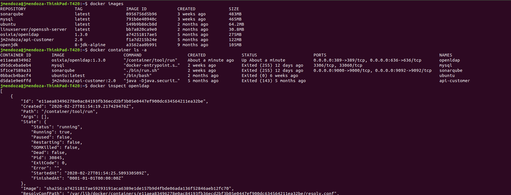
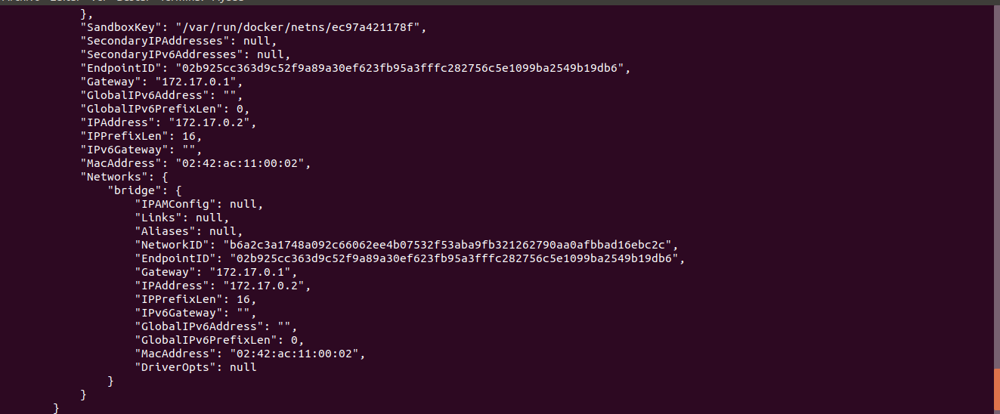
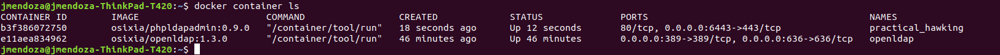
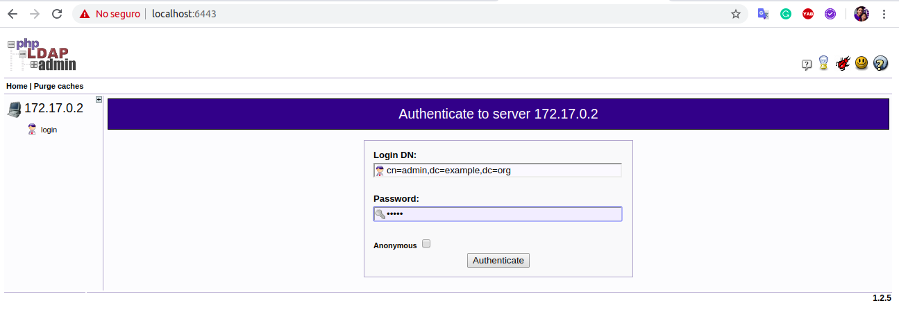
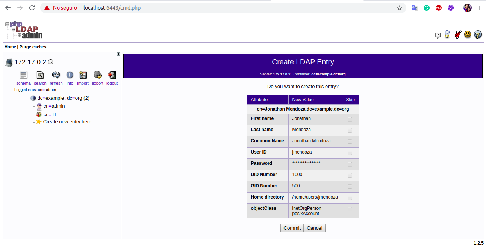
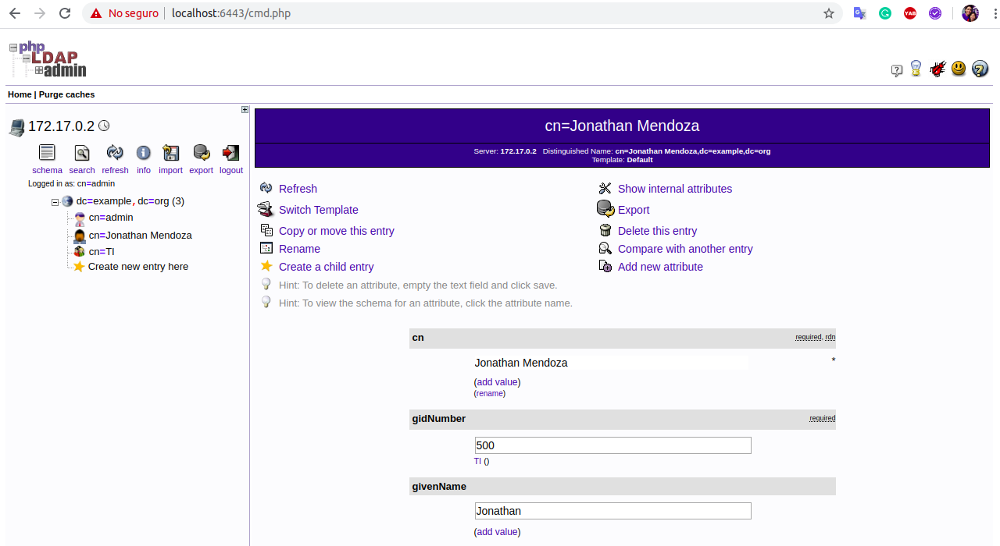
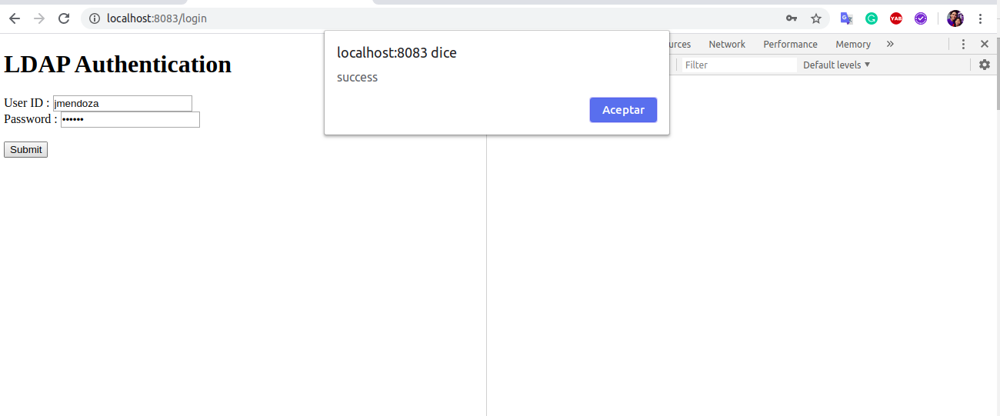
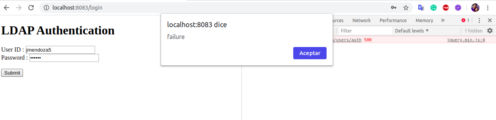
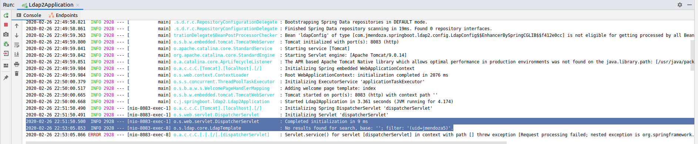

# Spring-Boot-Ldap
Example Authenticating a User with LDAP - Spring Boot

### Run OpenLDAP docker image

jmendoza@jmendoza-ThinkPad-T420:~$ docker run -p 389:389 -p 636:636 --name openldap --detach osixia/openldap:1.3.0

### Run a phpLDAPadmin docker image, replacing with your ldap host or IP

docker run -p 6443:443 \
        --env PHPLDAPADMIN_LDAP_HOSTS=172.17.0.2 \
        --detach osixia/phpldapadmin:0.9.0

You can access phpLDAPadmin on https://localhost:6443
- user: cn=admin,dc=example,dc=org 
- clave: admin

Create user 

### Test OpenLDAP with Spring Boot

Case of success

Case of failure

